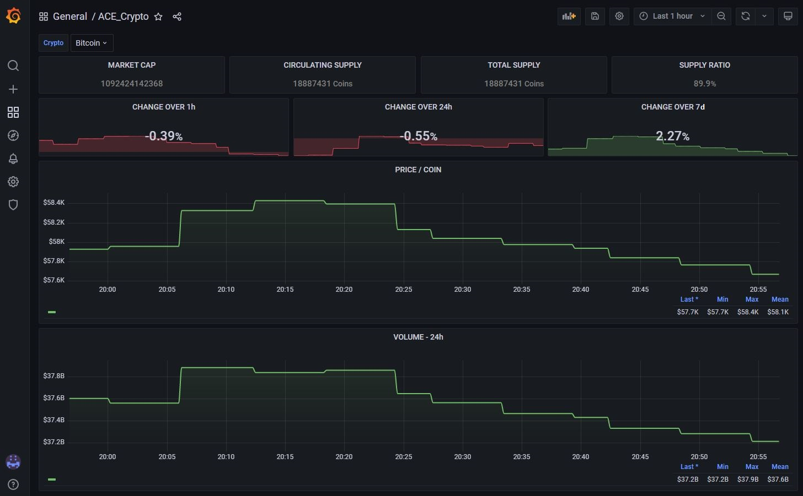

# AlternativeCryptoExporter
A crypto price exporter that uses [alternative.me](https://alternative.me/crypto) API to create metrics.
Sorry for skipping unit tests, this is just for fun and not production ready.

```
# HELP crypto_currency_circulating_supply Last market cap of crypto currency.
# TYPE crypto_currency_circulating_supply gauge
crypto_currency_circulating_supply{id="1",name="Bitcoin",quotes="USD",symbol="BTC"} 1.8886531e+07
crypto_currency_circulating_supply{id="1027",name="Ethereum",quotes="USD",symbol="ETH"} 1.18540258e+08
# HELP crypto_currency_market_cap Last market cap of crypto currency.
# TYPE crypto_currency_market_cap gauge
crypto_currency_market_cap{id="1",name="Bitcoin",quotes="USD",symbol="BTC"} 1.107832609404e+12
crypto_currency_market_cap{id="1027",name="Ethereum",quotes="USD",symbol="ETH"} 5.25153843577e+11
# HELP crypto_currency_max_supply Last market cap of crypto currency.
# TYPE crypto_currency_max_supply gauge
crypto_currency_max_supply{id="1",name="Bitcoin",quotes="USD",symbol="BTC"} 2.1e+07
crypto_currency_max_supply{id="1027",name="Ethereum",quotes="USD",symbol="ETH"} 0
# HELP crypto_currency_price Last price of crypto currency.
# TYPE crypto_currency_price gauge
crypto_currency_price{id="1",name="Bitcoin",quotes="USD",symbol="BTC"} 58324
crypto_currency_price{id="1027",name="Ethereum",quotes="USD",symbol="ETH"} 4416.08
# HELP crypto_currency_price_change_percentage Last price percentage change of crypto currency.
# TYPE crypto_currency_price_change_percentage gauge
crypto_currency_price_change_percentage{duration="1h",id="1",name="Bitcoin",quotes="USD",symbol="BTC"} -0.458319938707213
crypto_currency_price_change_percentage{duration="1h",id="1027",name="Ethereum",quotes="USD",symbol="ETH"} -0.687925625625881
crypto_currency_price_change_percentage{duration="24h",id="1",name="Bitcoin",quotes="USD",symbol="BTC"} 6.42657999490841
crypto_currency_price_change_percentage{duration="24h",id="1027",name="Ethereum",quotes="USD",symbol="ETH"} 7.63462390915596
crypto_currency_price_change_percentage{duration="7d",id="1",name="Bitcoin",quotes="USD",symbol="BTC"} -1.37878028025067
crypto_currency_price_change_percentage{duration="7d",id="1027",name="Ethereum",quotes="USD",symbol="ETH"} 2.23913240329279
# HELP crypto_currency_total_supply Last market cap of crypto currency.
# TYPE crypto_currency_total_supply gauge
crypto_currency_total_supply{id="1",name="Bitcoin",quotes="USD",symbol="BTC"} 1.8886531e+07
crypto_currency_total_supply{id="1027",name="Ethereum",quotes="USD",symbol="ETH"} 1.18540258e+08
# HELP crypto_currency_volume_24h Last volume of crypto currency in last 24h.
# TYPE crypto_currency_volume_24h gauge
crypto_currency_volume_24h{id="1",name="Bitcoin",quotes="USD",symbol="BTC"} 3.2845861897e+10
crypto_currency_volume_24h{id="1027",name="Ethereum",quotes="USD",symbol="ETH"} 2.133800858e+10
```
## Arguments
A list of possible values (`name` or `symbol`) for `-watch` can be obtained from [here](https://api.alternative.me/v2/listings/).
| Argument    | Default | Description                                                                                                               |
|-------------|---------|---------------------------------------------------------------------------------------------------------------------------|
| -log-level  | 4       | Log level {'0' NONE, '1' FATAL, '2' ERROR, '3' WARNING, '4' INFO, '5' DEBUG}                                              |
| -listen     | ":8080" | Set listen endpoint e.g ':8080'                                                                                           |
| -quotes     | "USD"   | Currency to display crypto quotes e.g. {USD', 'EUR', 'GBP', 'RUB', 'JPY', 'CAD', 'KRW', 'PLN', 'BTC', 'ETH', 'XRP', 'LTC} |
| -watch      | [ ]     | Define currency to watch e.g. {'BTC', 'LTC'}                                                                              |

## Example



Execute the following comands on `./example`.
Run example using:
```
docker-compose up
```
Now you can use [prometheus](http://localhost:9090/graph) for queries.
Or check out the predefined [Grafana crypto dashboard](http://localhost:8081/) (User: `ace`, PW: `ace`). 

Stop example using:
```
docker-compose down
```